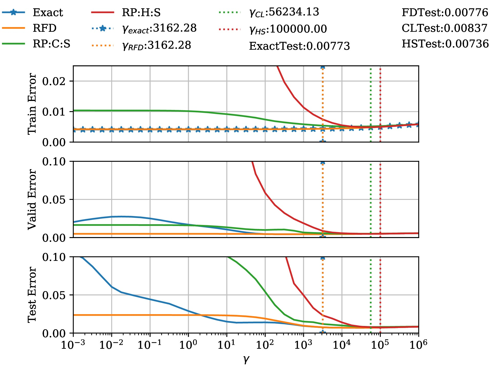

<!--
    Licensed to the Apache Software Foundation (ASF) under one
    or more contributor license agreements.  See the NOTICE file
    distributed with this work for additional information
    regarding copyright ownership.  The ASF licenses this file
    to you under the Apache License, Version 2.0 (the
    "License"); you may not use this file except in compliance
    with the License.  You may obtain a copy of the License at

      http://www.apache.org/licenses/LICENSE-2.0

    Unless required by applicable law or agreed to in writing,
    software distributed under the License is distributed on an
    "AS IS" BASIS, WITHOUT WARRANTIES OR CONDITIONS OF ANY
    KIND, either express or implied.  See the License for the
    specific language governing permissions and limitations
    under the License.
-->

# FrequentDirectionsRidgeRegression
This repository contains code for using _Frequent Directions_ (FD) for using ridge regression as proposed 
in [Shi & Phillips 2020](https://arxiv.org/abs/2002.02013).
The repo is split into `src` and `notebooks` with the latter being experimental/draft versions of the code 
which is then placed in  `src`, along with some discussion explaining the functionality.

### Datasets
We test on open datasets such as the [California Housing Dataset](https://scikit-learn.org/stable/modules/generated/sklearn.datasets.fetch_california_housing.html) and the [YearPredictionsMSD Dataset](https://archive.ics.uci.edu/ml/datasets/YearPredictionMSD).  The latter cannot be saved into the repo as it exceeds the 100Mb file size, but details for downloading and preprocessing can be found in `notebooks`.

### Scripts
- `src/california_housing_regression.py, src/year_predictions_regression.py` showcase how FD is used in ridge regression for training, validating and then test evaluation.  To obtain the necessary data for ``src/california_housing_regression.py` one can directly read this from the repository as shown in the script.  However, for `src/year_predictions_regression.py`, the `notebook/SongPredictions/YearPredictions.ipynb` should first be executed (or at least read) to obtain the data.  
- `src/experiments/` contains the experiments shown in [Dickens 2020](https://arxiv.org/abs/2011.03607). These are primarily `src/experiments/bias_variance_tradeoff.py` and `src/experiments/iterative_sketching.py`.

### Reproducibility
This code runs on `Python 3.7.6` and uses only standard libraries (e.g `NumPy, scikit-learn, matplotlib, pandas`). 

### Future Work
- Many works require getting the top m components via a power method or truncated SVD, can we sub in FD?
- How does FD performance compare to power iteration?
- Multiple response ridge regression comparing frequent direcitons and co-occuring directions
